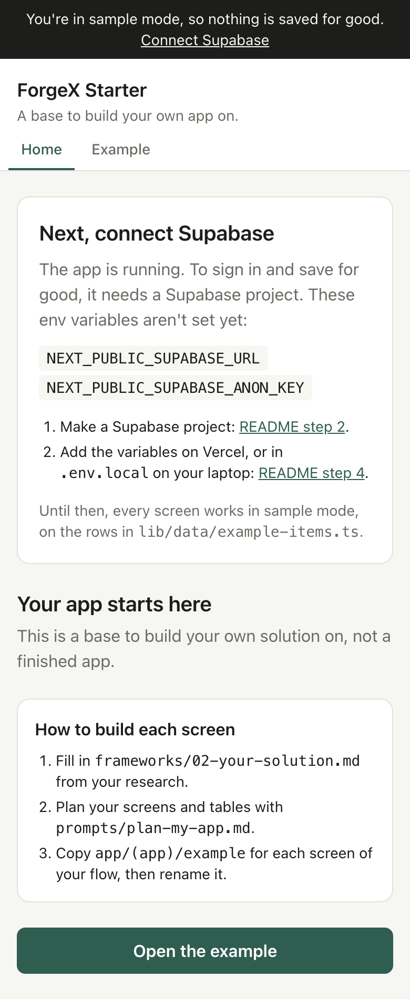
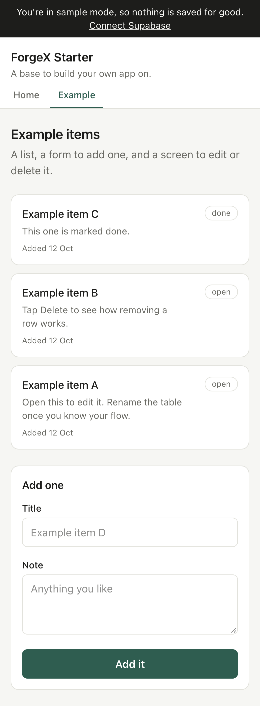

# ForgeX Starter

A base to build your own solution on. It is not a finished app, and it never tells you what to build.

[](https://vercel.com/new/clone?repository-url=https://github.com/chaaandu/forgex-starter&project-name=forgex-starter&repository-name=forgex-starter&env=NEXT_PUBLIC_SUPABASE_URL,NEXT_PUBLIC_SUPABASE_ANON_KEY&envDescription=Your%20Supabase%20project%20URL%20and%20publishable%20(anon)%20key.%20Both%20are%20in%20Supabase%20under%20Connect.&envLink=https://github.com/chaaandu/forgex-starter%232-create-your-supabase-project)

## What this is

You do the research. You come up with the idea. This repo gives you everything around it:

- sign-in with Google;
- a database that keeps each person's data private;
- a live link on the internet;
- one worked example of a screen that lists, adds, edits and deletes rows;
- frameworks to fill in, and prompts to paste into Cursor.

The idea in one line: based on my research and my idea, here is my solution, so how do I add it? Every file here helps you answer that, one screen at a time.

It runs before you set anything up. Until you connect Supabase, the app runs in **sample mode**: every screen uses example rows kept in memory, and a dark note at the top says so.



## The challenge

> **2 lakh kiranas closed in a single year.** A retailer federation says 2 lakh kiranas closed in a year, and 60% of Mumbai grocery stores near quick-commerce dark stores saw volumes fall.
> **The challenge:** Help a kirana keep its loyal households ordering from it rather than from the nearest dark store.

The full brief is at the top of [`frameworks/01-research-doc.md`](frameworks/01-research-doc.md).

## What's in each folder

| Folder | What's in it | When you use it |
| --- | --- | --- |
| [`frameworks/`](frameworks/) | 7 short templates with `[brackets]` to fill in: research, your solution, flows, data, scope, pitch and case study | Before you build anything, and at each phase |
| [`prompts/`](prompts/) | 10 base prompts to paste into Cursor, each naming the files in this repo | Every time you build or fix something |
| [`cards/`](cards/README.md) | 15 daily build cards, from 12 Oct to 26 Oct | One a day |
| `app/` | The screens. `app/(app)/` holds the signed-in screens, and `app/(app)/example/` is the pattern to copy | When you build a screen |
| `components/` | 5 small pieces every screen reuses: Button, Field, Card, EmptyState, PageHeader | Inside your screens |
| `lib/` | Settings, sign-in, AI, and `lib/data/`: every read and write to the database | When you add a table |
| `supabase/` | The database setup: tables and privacy rules, plus example rows | Card 10, and when you add a table |
| `docs/screenshots/` | The pictures in this README | Never, unless you change them |

A few words you'll meet:

- **Next.js** is the framework the app is built with: it turns the files in `app/` into screens.
- **Supabase** keeps your data and handles sign-in.
- **Vercel** puts your app on the internet.
- **Cursor** is the code editor with AI built in. You paste the prompts there.

## Before you start

You need:

- a GitHub account (free, at [github.com](https://github.com));
- a Google account;
- about 15 minutes.

Steps 1 to 6 all happen in your browser. You don't need to install anything until you want to change the code on your laptop.

**In the sprint, you don't do all 6 at once.** Card 1 is step 1. Card 3 is step 4, in sample mode. Card 10 is steps 2, 3 and 5. Read them all now so you know the shape.

## 1. Make your own copy on GitHub

GitHub keeps your code online. A **repo** (short for repository) is one project's folder on GitHub, with every change you've ever made to it.

1. Sign in to GitHub.
2. Open [github.com/chaaandu/forgex-starter](https://github.com/chaaandu/forgex-starter).
3. Click **Use this template**, then **Create a new repository**. A **template** is a repo you copy to start your own.
4. Under **Owner**, pick your own account. Under **Repository name**, write a name for your app.
5. Choose **Public**. Anyone can read a public repo's code, which is fine: your keys never go in the code (step 4 explains where they go).
6. Click **Create repository**.


You now have your own repo at `github.com/your-name/your-app`. Everything you change from now on goes there.

## 2. Create your Supabase project

Supabase gives your app a **database**, the place where your app's data is kept. It also handles sign-in.

1. Go to [supabase.com](https://supabase.com) and click **Start your project**. Sign in with GitHub.
2. Click **New project**. Name it after your app. Set a database password and save it somewhere safe. For **Region**, pick Mumbai, the closest to the people you're building for.
3. Wait about 2 minutes while Supabase sets it up.
4. Open your repo on GitHub and go to `supabase/migrations/0001_base.sql`. Click the copy icon above the file (**Copy raw file**). A **migration** is a file of database code that creates or changes your tables.
5. Back in Supabase, open **SQL Editor** in the left menu. Paste the whole file and click **Run**. You should see **Success. No rows returned**.
6. Click **Connect** at the top of the project. Copy two values and keep them for step 4:
   - the **Project URL**, like `https://abcdefgh.supabase.co`;
   - the **publishable key**, which starts with `sb_publishable_`. Older projects call it the **anon key**. Either works.


These two values are safe in a browser. What keeps one person from seeing another's rows is **row-level security** (RLS): rules inside the database, written in the migration, that let each person see only their own rows. Never put the **secret key** (or **service_role** key) in this app.

## 3. Turn on Google sign-in

Google needs to know your app before it lets people sign in to it. You make an **OAuth client** in Google Cloud Console, which is your app's ID with Google, and then give it to Supabase.

**In Supabase, first:**

1. Go to **Authentication**, then **Sign In / Providers**, then **Google**.
2. Copy the **Callback URL** shown there. It looks like `https://abcdefgh.supabase.co/auth/v1/callback`. Leave this tab open.

**In Google Cloud Console:**

1. Go to [console.cloud.google.com](https://console.cloud.google.com) and sign in.
2. Click the project picker at the top, then **New project**. Name it after your app and click **Create**. Make sure it's selected at the top.
3. In the search bar, type **Google Auth Platform** and open it. Click **Get started**. This sets up the **consent screen**, the box people see when they sign in.
   - **App name**: your app's name. **User support email**: yours.
   - **Audience**: **External**.
   - **Contact information**: your email.
   - Agree to the policy and click **Create**.
4. Open **Audience** and click **Publish app**, then **Confirm**. Without this, only the Google accounts you list as test users can sign in.
5. Open **Clients** and click **Create client**.
   - **Application type**: **Web application**.
   - **Name**: anything, like `Supabase`.
   - Under **Authorised redirect URIs**, click **Add URI** and paste the Callback URL from Supabase. A **redirect URI** is the address Google sends people back to after they sign in.
   - Click **Create**.
6. Copy the **Client ID** and the **Client secret**.


**Back in Supabase:**

1. On the Google provider, turn on **Enable Sign in with Google**.
2. Paste the **Client ID** and the **Client secret**.
3. Click **Save**.


## 4. Put it live on Vercel

Vercel puts your app on the internet. To **deploy** is to build your code and publish it at a link. Vercel deploys again every time you push a change to GitHub.

Your app needs the two Supabase values from step 2. It reads them from **env variables** (environment variables): settings kept outside your code, so keys never end up on GitHub.

You made your copy in step 1, so import it:

1. Go to [vercel.com](https://vercel.com) and sign up with GitHub. Pick the free **Hobby** plan.
2. Click **Add New**, then **Project**. Find your repo and click **Import**. If it isn't listed, click **Adjust GitHub App Permissions** and give Vercel access to it.
3. Open **Environment Variables** and add these two:

   | Name | Value |
   | --- | --- |
   | `NEXT_PUBLIC_SUPABASE_URL` | the Project URL from step 2 |
   | `NEXT_PUBLIC_SUPABASE_ANON_KEY` | the publishable (anon) key from step 2 |

4. Click **Deploy** and wait 1–2 minutes.
5. Copy your link. It looks like `https://your-app.vercel.app`.


**The Deploy button.** The **Deploy with Vercel** button at the top makes a new GitHub copy and puts it live in one go, asking for the same two env variables. Use it only if you skipped step 1. If you already have a copy, the button makes a second one, and your work ends up split across two repos.

**No Supabase yet?** Leave the env variables out and click **Deploy**. Your app goes live in sample mode. Add them later under **Settings**, then **Environment Variables**. Then open **Deployments**, click the **⋯** on the latest one and choose **Redeploy**. New env variables only reach your app on a new deploy.

## 5. Tell Supabase your live link

After sign-in, Supabase only sends people back to addresses it trusts. Add yours.

1. In Supabase, go to **Authentication**, then **URL Configuration**.
2. Set **Site URL** to your Vercel link, like `https://your-app.vercel.app`.
3. Under **Redirect URLs**, click **Add URL** and add both:
   - `https://your-app.vercel.app/**` (with your own link);
   - `http://localhost:3000/**`, for when you run the app on your laptop.
4. Click **Save**.


## 6. Open your live link

1. Open your Vercel link on your phone.
2. Tap **Sign in with Google**.
3. Open the **Example** tab and add one item.
4. Sign out, and sign in with a second Google account. The item you added isn't there. That is row-level security at work.

The sample-mode note at the top is gone. What you add is now saved in Supabase.

## First task: make it yours

Make the app look and sound like yours: its name, its colours and its words. Card 4 walks you through it.

**The name and tagline:** `lib/config.ts`.

```ts
export const appConfig = {
  name: 'ForgeX Starter',
  tagline: 'A base to build your own app on.',
}
```

**The colours:** `app/globals.css`, inside `@theme`. Each line is one colour, with a note saying where it shows. A colour is written as a hex code, like `#2f5d50`.

```css
  --color-brand: #2f5d50; /* buttons, links and the selected tab */
  --color-brand-ink: #ffffff; /* text that sits on the brand colour */
  --color-page: #f6f6f3; /* the page background */
  --color-card: #ffffff; /* boxes, lists and forms */
  --color-ink: #1d1d1b; /* the main text */
  --color-muted: #6b6b65; /* smaller, quieter text */
  --color-line: #e2e2dc; /* lines around boxes and between rows */
```

**The words:** the home screen, `app/(app)/page.tsx`. Replace the welcome with a line about who your app is for.

To have Cursor do all three, paste this into the chat in Cursor:

```text
I'm building an app for [who it's for, from frameworks/02-your-solution.md].
1. In lib/config.ts, change name to "[your app's name]" and tagline to
   "[one short line, in words that person would use]".
2. In app/globals.css, change the 7 colours inside @theme to suit [the feel you want].
   Keep --color-brand-ink readable on --color-brand, and --color-ink readable on
   --color-page (contrast of at least 4.5 to 1).
3. In app/(app)/page.tsx, change the text under "Your app starts here" to one
   sentence about who this app is for. Don't change anything else on that screen.
Don't touch any other file. Then tell me which lines you changed.
```

## How to build each screen

You build your app one screen at a time, always in the same 4 steps.

1. **Fill in the frameworks.** Your research doc ([`01`](frameworks/01-research-doc.md)) feeds your solution ([`02`](frameworks/02-your-solution.md)). Your solution gives you one core flow ([`03`](frameworks/03-flows.md)), and the flow gives you your tables ([`04`](frameworks/04-data.md)).
2. **Plan with Cursor.** Paste [`prompts/plan-my-app.md`](prompts/plan-my-app.md). It turns your solution and flow into a list of screens and tables, and which to build first. It writes no code.
3. **Copy the example folder.** Every screen starts as a copy of `app/(app)/example/`, renamed. [`prompts/build-a-screen.md`](prompts/build-a-screen.md) does it with you.
4. **Add a tab.** Add one line to `TABS` in `components/Nav.tsx`.

**What's in the example folder:**

| File | What it does |
| --- | --- |
| `app/(app)/example/page.tsx` | The list, and a form to add one |
| `app/(app)/example/[id]/page.tsx` | One row, to edit or delete |
| `app/(app)/example/actions.ts` | The **server actions**: functions that run on the server when a form is sent, and save what it holds |
| `lib/data/example-items.ts` | Every read and write for the table, in sample mode and in Supabase, side by side |

The brackets in `app/(app)/` make it a **route group**: a folder that groups screens without adding to the address. So `app/(app)/example/page.tsx` is the screen at `/example`.



## Run it on your laptop

You need three things installed:

- **Node.js**, the engine that runs the app's code. Get the LTS version from [nodejs.org](https://nodejs.org).
- **Git**, which tracks your changes. Get it from [git-scm.com](https://git-scm.com). Macs may offer to install it the first time you need it.
- **Cursor**, the code editor. Get it from [cursor.com](https://cursor.com).

Then:

1. Open Cursor and choose **Clone repo**. Paste your repo's link, like `https://github.com/your-name/your-app`, and pick a folder.
2. Open the terminal: **View**, then **Terminal**. The **terminal** is where you type commands for your laptop to run.
3. Type `npm install` and press Enter. **npm** downloads the packages the app needs into a folder called `node_modules`. This takes a minute or two.
4. Type `npm run dev` and press Enter.
5. Open [http://localhost:3000](http://localhost:3000). **localhost** means your own laptop: only you can see this.

The app runs in sample mode until you add your keys. To add them:

1. Make a copy of `.env.example` and name it `.env.local`.
2. Fill in `NEXT_PUBLIC_SUPABASE_URL` and `NEXT_PUBLIC_SUPABASE_ANON_KEY`.
3. In the terminal, press Ctrl+C to quit the app, then run `npm run dev` again.

`.env.local` never goes to GitHub. The `.gitignore` file, a list of files Git leaves out, makes sure of that.

**Save and send your work.** A **commit** is a saved snapshot of your code with a short message. To **push** is to send your commits to GitHub. In Cursor, open **Source Control** on the left, write a message, click **Commit**, then **Sync Changes**. Vercel sees the push and deploys it.

Before you push a big change, run `npm run build`. It checks the code the same way Vercel will.

## Optional: turn on AI

AI is an extra. Everything works without it, and it stays off until you set a key.

`lib/ai.ts` has one function, `askAI({ instructions, input })`. It sends your instructions and the input to an AI model and gives you back its answer as text. `app/api/ai/route.ts` is the address your screens can call. What you use it for is up to you: [`cards/extra-ai.md`](cards/extra-ai.md) and [`prompts/use-ai-for-one-step.md`](prompts/use-ai-for-one-step.md) help you pick one step of your flow.

**Get a free Gemini key:**

1. Go to [aistudio.google.com](https://aistudio.google.com) and sign in with Google.
2. Click **Get API key**, then **Create API key**. An **API key** is a password that lets your app use a service.
3. Copy it. Treat it like a password: never paste it into your code, and never commit it.

The free tier has daily limits that are plenty for building and testing.

**Turn it on:**

- On Vercel: add an env variable `GEMINI_API_KEY` with your key, then redeploy (step 4 shows how).
- On your laptop: add `GEMINI_API_KEY=your-key` to `.env.local`, then quit and restart `npm run dev`.

To check, open `/api/ai` on your app, like [http://localhost:3000/api/ai](http://localhost:3000/api/ai). It says `"on":true` once AI is on.

**Use Claude instead.** Set `AI_PROVIDER` to `claude` and `ANTHROPIC_API_KEY` to a key from [console.anthropic.com](https://console.anthropic.com). The API is paid for separately: a Claude Pro plan doesn't cover it. To try a different model, set `GEMINI_MODEL` or `CLAUDE_MODEL`.

## If something breaks

**1. The live link still says you're in sample mode.**
Your env variables aren't reaching the app. In Vercel, open **Settings**, then **Environment Variables**. Check both names are spelt exactly as in step 4, with no spaces in the values. Then redeploy: env variables only reach the app on a new deploy.

**2. Sign-in says the provider is not enabled.**
Google isn't turned on in Supabase. Go back to the last part of step 3: turn on **Enable Sign in with Google**, paste the Client ID and secret, and click **Save**.

**3. Google shows redirect_uri_mismatch, or says access is blocked.**
For redirect_uri_mismatch, the redirect URI in Google Cloud Console must be exactly the Callback URL from Supabase, ending in `/auth/v1/callback`. For access blocked, the app is still in testing: open **Audience** in Google Auth Platform and click **Publish app**, or add the Google account under **Test users**.

**4. After signing in, you land on localhost, or back on the sign-in screen.**
Supabase doesn't trust your link yet. Do step 5: set **Site URL** to your Vercel link and add `https://your-app.vercel.app/**` to **Redirect URLs**.

**5. After sign-in, the app says That didn't work, and the logs can't find a table.**
To read the logs, open your project on Vercel and click **Logs**. If they say **Could not find the table 'public.example_items'**, the tables aren't there yet. Run `supabase/migrations/0001_base.sql` in the Supabase SQL Editor (step 2). Make sure you pasted the whole file. If you added a table of your own, run its migration file too.

**On your laptop:** if `npm run dev` says `next` isn't recognised, run `npm install` first. If `npm install` warns about vulnerabilities, leave them: they're in build tools, not in your live app. Don't run `npm audit fix --force`, because it moves the app to a version of Next.js this starter isn't built for.

For any other error, paste it into Cursor with [`prompts/fix-an-error.md`](prompts/fix-an-error.md).

## Where things live

| What | Where |
| --- | --- |
| Your app's name and tagline | `lib/config.ts` |
| Your colours | `app/globals.css`, the `@theme` block |
| The home screen | `app/(app)/page.tsx` |
| The example to copy for each screen | `app/(app)/example/` |
| Every read and write for a table | `lib/data/`, one file per table |
| Who is signed in | `lib/auth.ts` |
| The tabs | `components/Nav.tsx` |
| Small UI pieces | `components/` |
| Sign-in | `app/login/` and `app/auth/callback/route.ts` |
| AI | `lib/ai.ts` and `app/api/ai/route.ts` |
| Tables and privacy rules | `supabase/migrations/` |
| Example rows for the database | `supabase/seed.sql` |
| Every env variable | `.env.example` |

The app is built with Next.js 15, TypeScript, Tailwind CSS v4 and Supabase. **TypeScript** is JavaScript with checks that catch mistakes before you run the code. **Tailwind** styles each element with short class names, like `p-4` for padding.
