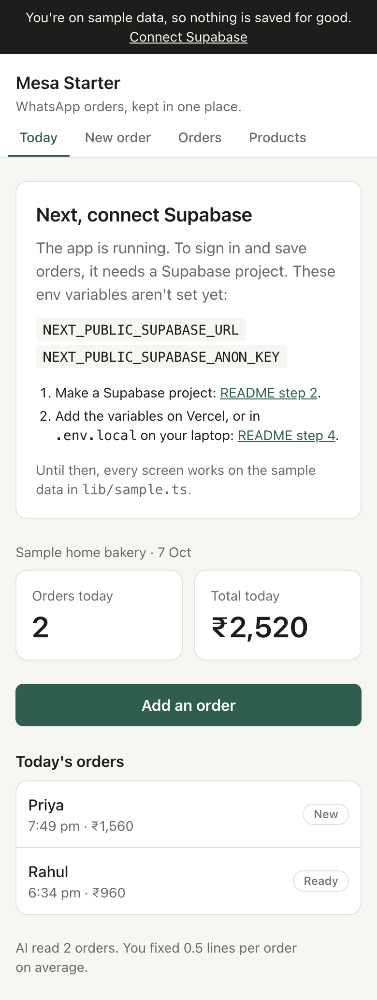

# Mesa Starter

A small app for a shop that takes orders on WhatsApp. Paste the message, pick what they ordered, and see what came in today and what it adds up to.

[](https://vercel.com/new/clone?repository-url=https://github.com/chaaandu/mesa-starter&project-name=mesa-starter&repository-name=mesa-starter&env=NEXT_PUBLIC_SUPABASE_URL,NEXT_PUBLIC_SUPABASE_ANON_KEY&envDescription=Your%20Supabase%20project%20URL%20and%20publishable%20(anon)%20key.%20Both%20are%20in%20Supabase%20under%20Connect.&envLink=https://github.com/chaaandu/mesa-starter%232-create-your-supabase-project)

What it does:

- Sign in with Google.
- Create your shop.
- Add your products, and change or delete them.
- Take a new order: paste the WhatsApp message, tap plus and minus to pick items, add the customer's name and phone, save.
- Move each order through **new**, **ready**, **delivered** and **paid** in one tap. Filter by status.
- See today's orders and today's total, in India time.
- Optional: let AI read the WhatsApp message and fill in the items for you.

It runs before you set anything up. Until you connect Supabase, every screen uses the sample data in `lib/sample.ts`, and a note at the top says so.



**Build cards.** The 15 daily cards in [`cards/`](cards/README.md) take you from this starter to your own app, one small task a day.

## Before you start

You need:

- a GitHub account (free, at [github.com](https://github.com));
- a Google account;
- about 15 minutes.

Steps 1 to 6 all happen in your browser. You don't need to install anything until you want to change the code on your laptop.

## 1. Make your own copy on GitHub

GitHub keeps your code online. A **repo** (short for repository) is one project's folder on GitHub, with every change you've ever made to it.

1. Sign in to GitHub.
2. Open [github.com/chaaandu/mesa-starter](https://github.com/chaaandu/mesa-starter).
3. Click **Use this template**, then **Create a new repository**. A **template** is a repo you copy to start your own.
4. Under **Owner**, pick your own account. Under **Repository name**, write a name for your app, like `asha-bakes`.
5. Choose **Public**. Anyone can read a public repo's code, which is fine: your keys never go in the code (step 4 explains where they go).
6. Click **Create repository**.


You now have your own repo at `github.com/your-name/your-app`. Everything you change from now on goes there.

## 2. Create your Supabase project

Supabase gives your app a **database**, the place where your shops, products and orders are kept. It also handles sign-in.

1. Go to [supabase.com](https://supabase.com) and click **Start your project**. Sign in with GitHub.
2. Click **New project**. Name it after your app. Set a database password and save it somewhere safe. For **Region**, pick Mumbai, the closest to your customers.
3. Wait about 2 minutes while Supabase sets it up.
4. Open your repo on GitHub and go to `supabase/migrations/0001_init.sql`. Click the copy icon above the file (**Copy raw file**). A **migration** is a file of database code that creates or changes your tables.
5. Back in Supabase, open **SQL Editor** in the left menu. Paste the whole file and click **Run**. You should see **Success. No rows returned**.
6. Click **Connect** at the top of the project. Copy two values and keep them for step 4:
   - the **Project URL**, like `https://abcdefgh.supabase.co`;
   - the **publishable key**, which starts with `sb_publishable_`. Older projects call it the **anon key**. Either works.


These two values are safe in a browser. What keeps one shop from seeing another's orders is **row-level security** (RLS): rules inside the database, written in the migration, that let each owner see only their own shop's rows. Never put the **secret key** (or **service_role** key) in this app.

## 3. Turn on Google sign-in

Google needs to know your app before it lets people sign in to it. You make an **OAuth client** in Google Cloud Console, which is your app's ID with Google, and then give it to Supabase.

**In Supabase, first:**

1. Go to **Authentication**, then **Sign In / Providers**, then **Google**.
2. Copy the **Callback URL** shown there. It looks like `https://abcdefgh.supabase.co/auth/v1/callback`. Leave this tab open.

**In Google Cloud Console:**

1. Go to [console.cloud.google.com](https://console.cloud.google.com) and sign in.
2. Click the project picker at the top, then **New project**. Name it after your app and click **Create**. Make sure it's selected at the top.
3. In the search bar, type **Google Auth Platform** and open it. Click **Get started**. This sets up the **consent screen**, the box people see when they sign in.
   - **App name**: your app's name. **User support email**: yours.
   - **Audience**: **External**.
   - **Contact information**: your email.
   - Agree to the policy and click **Create**.
4. Open **Audience** and click **Publish app**, then **Confirm**. Without this, only the Google accounts you list as test users can sign in.
5. Open **Clients** and click **Create client**.
   - **Application type**: **Web application**.
   - **Name**: anything, like `Supabase`.
   - Under **Authorised redirect URIs**, click **Add URI** and paste the Callback URL from Supabase. A **redirect URI** is the address Google sends people back to after they sign in.
   - Click **Create**.
6. Copy the **Client ID** and the **Client secret**.


**Back in Supabase:**

1. On the Google provider, turn on **Enable Sign in with Google**.
2. Paste the **Client ID** and the **Client secret**.
3. Click **Save**.


## 4. Put it live on Vercel

Vercel puts your app on the internet. To **deploy** is to build your code and publish it at a link. Vercel deploys again every time you push a change to GitHub.

Your app needs the two Supabase values from step 2. It reads them from **env variables** (environment variables): settings kept outside your code, so keys never end up on GitHub.

You made your copy in step 1, so import it:

1. Go to [vercel.com](https://vercel.com) and sign up with GitHub. Pick the free **Hobby** plan.
2. Click **Add New**, then **Project**. Find your repo and click **Import**. If it isn't listed, click **Adjust GitHub App Permissions** and give Vercel access to it.
3. Open **Environment Variables** and add these two:

   | Name | Value |
   | --- | --- |
   | `NEXT_PUBLIC_SUPABASE_URL` | the Project URL from step 2 |
   | `NEXT_PUBLIC_SUPABASE_ANON_KEY` | the publishable (anon) key from step 2 |

4. Click **Deploy** and wait 1–2 minutes.
5. Copy your link. It looks like `https://asha-bakes.vercel.app`.


**The Deploy button.** The **Deploy with Vercel** button at the top makes a new GitHub copy and puts it live in one go, asking for the same two env variables. Use it only if you skipped step 1. If you already have a copy, the button makes a second one, and your work ends up split across two repos.

**No Supabase yet?** Leave the env variables out and click **Deploy**. Your app goes live on sample data. Add them later under **Settings**, then **Environment Variables**. Then open **Deployments**, click the **⋯** on the latest one and choose **Redeploy**. New env variables only reach your app on a new deploy.

## 5. Tell Supabase your live link

After sign-in, Supabase only sends people back to addresses it trusts. Add yours.

1. In Supabase, go to **Authentication**, then **URL Configuration**.
2. Set **Site URL** to your Vercel link, like `https://asha-bakes.vercel.app`.
3. Under **Redirect URLs**, click **Add URL** and add both:
   - `https://asha-bakes.vercel.app/**` (with your own link);
   - `http://localhost:3000/**`, for when you run the app on your laptop.
4. Click **Save**.


## 6. Open your live link

1. Open your Vercel link on your phone.
2. Tap **Sign in with Google**.
3. Name your shop.
4. Add 5 products.
5. Paste a WhatsApp message, pick the items, and save your first order.

The sample-data note at the top is gone. Your orders are now saved in Supabase.

## First task: your shop's name and colours

Make the app look like it belongs to your shop. Two files hold everything.

**The name and tagline:** `lib/config.ts`, lines 7 and 8.

```ts
export const appConfig = {
  name: 'Mesa Starter',
  tagline: 'WhatsApp orders, kept in one place.',
}
```

**The colours:** `app/globals.css`, lines 12 to 18, inside `@theme`. Each line is one colour, with a note saying where it shows.

```css
  --color-brand: #2f5d50; /* buttons, links and the selected tab */
  --color-brand-ink: #ffffff; /* text that sits on the brand colour */
  --color-page: #f6f6f3; /* the page background */
  --color-card: #ffffff; /* boxes, lists and forms */
  --color-ink: #1d1d1b; /* the main text */
  --color-muted: #6b6b65; /* smaller, quieter text */
  --color-line: #e2e2dc; /* borders and dividers */
```

To have Cursor do it, open the repo in Cursor and paste this into the chat:

```text
I'm building an order app for [a home baker in Pune called Asha's Bakes].
1. In lib/config.ts, change name to "[Asha's Bakes]" and tagline to one short line
   an owner like this would say about the app.
2. In app/globals.css, change the 7 colours inside @theme to suit this shop.
   Keep --color-brand-ink readable on --color-brand, and --color-ink readable on
   --color-page (contrast of at least 4.5 to 1).
   Don't touch any other file.
3. Tell me which lines you changed, and why you picked each colour.
```

Check it with `npm run dev` on your laptop, or push it and open your live link. Then commit: `Make it Asha's Bakes: name and colours`.

## Optional: turn on AI

AI is an extra. Everything works without it.

With AI on, the New order screen shows a **Read with AI** button. AI reads the pasted message, matches it to your products and fills in the items. You check them, fix anything it got wrong, and save. The app counts how many lines you fixed. The home screen shows the average, so you can see how often AI gets an order right.

**Get a free Gemini key:**

1. Go to [aistudio.google.com](https://aistudio.google.com) and sign in with Google.
2. Click **Get API key**, then **Create API key**. An **API key** is a password that lets your app use a service.
3. Copy it. Treat it like a password: never paste it into your code, and never commit it.

The free tier has daily limits that are plenty for building and testing.

**Turn it on:**

- On Vercel: add an env variable `GEMINI_API_KEY` with your key, then redeploy (step 4 shows how).
- On your laptop: add `GEMINI_API_KEY=your-key` to `.env.local`, then stop and restart `npm run dev`.

**Use Claude instead.** Set `AI_PROVIDER` to `claude` and `ANTHROPIC_API_KEY` to a key from [console.anthropic.com](https://console.anthropic.com). The API is paid separately: your Claude Pro plan doesn't include API credits.

The code is in `lib/ai.ts` (what AI is asked) and `app/api/parse-order/route.ts` (the address the button calls). To try a different Gemini model, set `GEMINI_MODEL`.

## Run it on your laptop

You need three things installed:

- **Node.js**, the engine that runs the app's code. Get the LTS version from [nodejs.org](https://nodejs.org).
- **Git**, which tracks your changes. Get it from [git-scm.com](https://git-scm.com). Macs may offer to install it the first time you need it.
- **Cursor**, the code editor. Get it from [cursor.com](https://cursor.com).

Then:

1. Open Cursor and choose **Clone repo**. Paste your repo's link, like `https://github.com/your-name/asha-bakes`, and pick a folder.
2. Open the terminal: **View**, then **Terminal**. The **terminal** is where you type commands for your laptop to run.
3. Type `npm install` and press Enter. It downloads the packages the app needs into a folder called `node_modules`. This takes a minute or two.
4. Type `npm run dev` and press Enter.
5. Open [http://localhost:3000](http://localhost:3000). **localhost** means your own laptop: only you can see this.

The app runs on sample data until you add your keys. To add them:

1. Make a copy of `.env.example` and name it `.env.local`.
2. Fill in `NEXT_PUBLIC_SUPABASE_URL` and `NEXT_PUBLIC_SUPABASE_ANON_KEY`.
3. In the terminal, press Ctrl+C to stop the app, then run `npm run dev` again.

`.env.local` never goes to GitHub. The `.gitignore` file, a list of files Git leaves out, makes sure of that.

**Save and send your work.** A **commit** is a saved snapshot of your code with a short message. To **push** is to send your commits to GitHub. In Cursor, open **Source Control** on the left, write a message, click **Commit**, then **Sync Changes**. Vercel sees the push and deploys it.

Before you push a big change, run `npm run build`. It checks the code the same way Vercel will.

## If something breaks

**1. The live link still says you're on sample data.**
Your env variables aren't reaching the app. In Vercel, open **Settings**, then **Environment Variables**. Check both names are spelt exactly as in step 4, with no spaces in the values. Then redeploy: env variables only reach the app on a new deploy.

**2. Sign-in says the provider is not enabled.**
Google isn't turned on in Supabase. Go back to the last part of step 3: turn on **Enable Sign in with Google**, paste the Client ID and secret, and click **Save**.

**3. Google shows redirect_uri_mismatch, or says access is blocked.**
For redirect_uri_mismatch, the redirect URI in Google Cloud Console must be exactly the Callback URL from Supabase, ending in `/auth/v1/callback`. For access blocked, the app is still in testing: open **Audience** in Google Auth Platform and click **Publish app**, or add the Google account under **Test users**.

**4. After signing in, you land on localhost, or back on the sign-in screen.**
Supabase doesn't trust your link yet. Do step 5: set **Site URL** to your Vercel link and add `https://your-app.vercel.app/**` to **Redirect URLs**.

**5. After sign-in, the app says That didn't work, and the logs can't find a table.**
To read the logs, open your project on Vercel and click **Logs**. If they say **Could not find the table 'public.shops'**, the tables aren't there yet. Run `supabase/migrations/0001_init.sql` in the Supabase SQL Editor (step 2). Make sure you pasted the whole file.

**On your laptop:** if `npm run dev` says `next` isn't recognised, run `npm install` first. If `npm install` warns about vulnerabilities, leave them: they're in build tools, not in your live app. Don't run `npm audit fix --force`, because it moves the app to a version of Next.js this starter isn't built for.

## Where things live

| What | Where |
| --- | --- |
| Your app's name and tagline | `lib/config.ts` |
| Your colours | `app/globals.css`, the `@theme` block |
| Sample data, before Supabase | `lib/sample.ts` |
| Every read and write to the database | `lib/data.ts` |
| Today screen | `app/page.tsx` |
| New order screen | `app/orders/new/page.tsx` and `NewOrderForm.tsx` |
| Orders screen | `app/orders/page.tsx` |
| Products screen | `app/products/page.tsx` |
| Sign-in | `app/login/` and `app/auth/callback/route.ts` |
| What each screen saves | `actions.ts` next to each screen |
| AI | `lib/ai.ts` and `app/api/parse-order/route.ts` |
| Tables and security rules | `supabase/migrations/0001_init.sql` |
| Sample products for a baker, kirana and pharmacy | `supabase/seed.sql` |
| Every env variable | `.env.example` |

The app is built with Next.js 15, TypeScript, Tailwind CSS v4 and Supabase.
