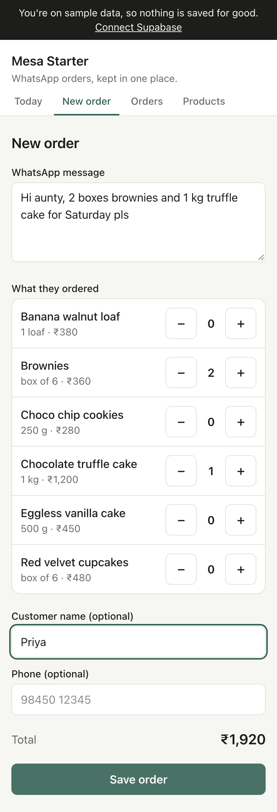

# Card 7 · An order from a WhatsApp message

**Sun 18 Oct** · Tools: WhatsApp, Cursor

## The task

Take 3 real WhatsApp orders from your research and enter each one in the app. Then fix the one thing that slowed you down.

1. **WhatsApp.** Pick 3 real order messages the owner got. Ask before you copy them, and change the customers' names.
2. **Browser.** On `localhost:3000`, open **New order**. Paste the first message. Tap plus and minus to pick the items, add a name, and tap **Save order**. Time it.
3. **Browser.** Do the same for the other two. Note what slowed you down each time.
4. **Cursor.** Paste the prompt below with what you noticed.
5. **Browser.** Enter one more message and time it again.



The message you paste is saved with the order. Open **Orders** and tap **WhatsApp message** under any order to see it.

## Why it matters

Orders get missed when they're scattered across chats. This is the moment one becomes a saved order, so it has to be fast.

## Paste this into Cursor

```text
I pasted this real WhatsApp message into the New order screen:
[2 kg atta, 1 toor dal, 6 eggs, Maggi 2 packet. Send by 7]
Entering it took me [90] seconds. What slowed me down: [scrolling through
40 products to find each one].

Change app/orders/new/NewOrderForm.tsx to fix that one thing.
[For example: add a search box above the product list that filters it as I type.]
Keep the plus and minus buttons, keep the total correct, and don't change how
the order is saved in app/orders/new/actions.ts.
Explain the change in 3 short points.
```

## When it works

- **Orders** shows your 3 orders, each with its WhatsApp message.
- The fourth order took less time than the first.

## If it breaks

**Save order stays grey.** No items are picked yet. At least one product needs a number above 0.

**It says That didn't save. Your order is still here.** The terminal in Cursor shows the real reason, in red. Copy it into the Cursor chat and ask what it means. After a change to the form, it's often a check in `actions.ts` that the new data doesn't pass.

## Commit now

```text
Faster order entry: search the product list
```
