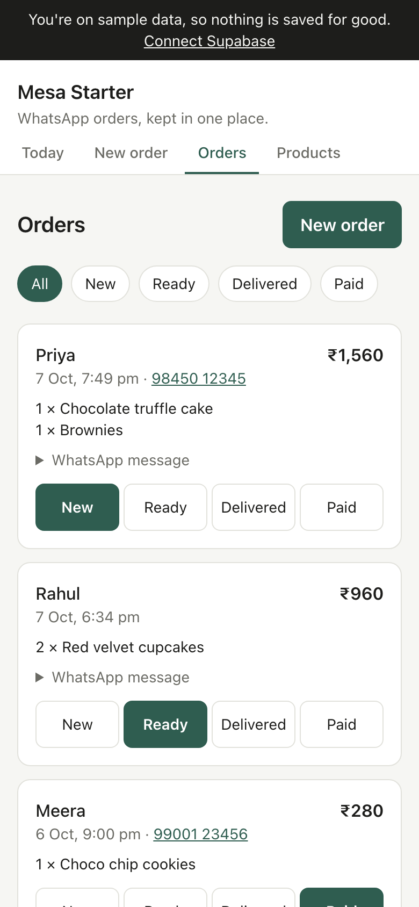

# Card 8 · Order status, in the owner's words

**Mon 19 Oct** · Tools: Cursor

## The task

Walk one order from **new** to **paid**, then change the status labels to the words your owner uses.

1. **Browser.** On **Orders**, pick an order. Tap **ready**, then **delivered**, then **paid**. Use the filter at the top to find it under each one.
2. **You.** Write down what your owner calls each step. A baker might say *Baking*, *Ready*, *Picked up*, *Paid*. A kirana might say *Naya*, *Packed*, *Sent*, *Paid*.
3. **Cursor.** Paste the prompt below with their words.



The database only accepts the 4 stored values: `new`, `ready`, `delivered` and `paid`. That rule is in `supabase/migrations/0001_init.sql`. So you change what people **see**, and keep what is **stored**.

## Why it matters

At the end of the day the owner needs to see, at a glance, which orders are still out and which are paid.

## Paste this into Cursor

```text
Show the 4 order statuses in the words my owner uses:
new = [Naya], ready = [Packed], delivered = [Sent], paid = [Paid].
- Put the labels in one exported object in lib/types.ts, so every screen uses
  the same words.
- Use it in app/orders/page.tsx (the status buttons and the filter) and in
  components/StatusPill.tsx.
- Change only the words people see. The stored values stay new, ready,
  delivered and paid, because the database only accepts those.
```

## When it works

- The status buttons, the filter and the Today list all show your owner's words.
- One tap moves an order, and the button you tapped fills in.

## If it breaks

**Tapping a status shows That didn't work, and the terminal says Invalid option.** The label got sent instead of the stored value. In `app/orders/page.tsx`, the hidden `status` input must still hold `new`, `ready`, `delivered` or `paid`. Only the button's text changes.

**Orders shows the new words, but Today still shows the old ones.** `components/StatusPill.tsx` still writes the status itself. Ask Cursor to make it use the labels from `lib/types.ts`.

## Commit now

```text
Status labels in the owner's words
```
